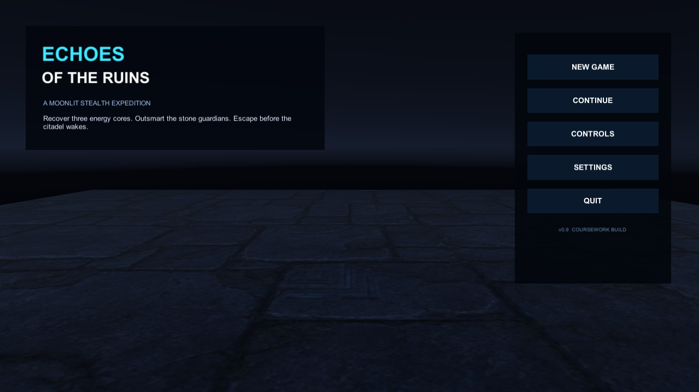
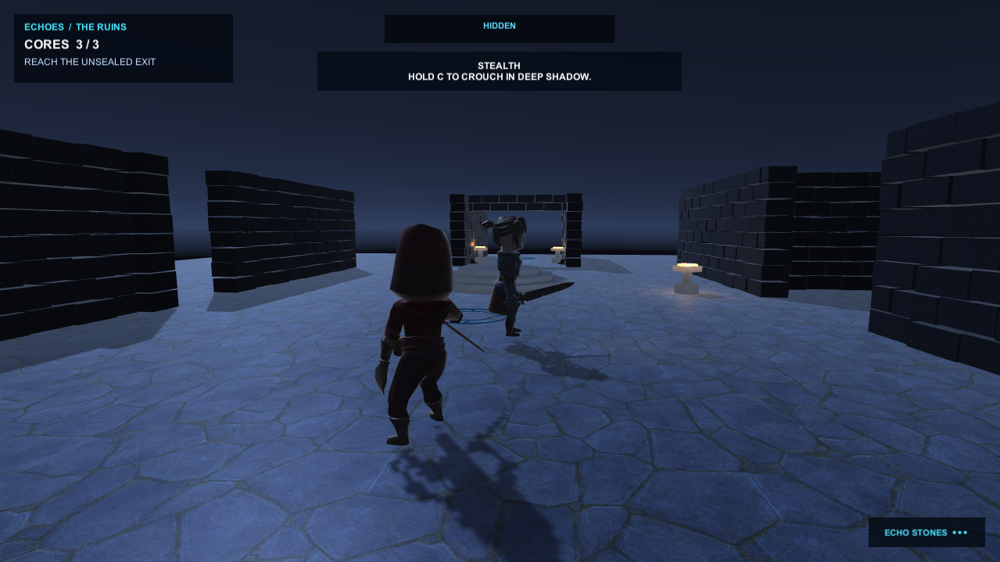

# 《遗迹回响》产品体验审计（2026-07-18）

## 审计范围

本次审计覆盖主菜单与进入 `ProductionRuins` 后的首分钟体验。用户目标是：在 30 秒内理解“收集三枚核心、躲避守卫、到达出口”，并获得可信的移动、追击与失败反馈。

## 步骤 1：主菜单 — 一般

优点：标题、简介和主操作区域能够分开，按钮顺序符合常见游戏菜单。

风险：画面中央大面积留空，缺少角色、遗迹或威胁预览；`COURSEWORK BUILD` 强化了演示感而非成品感；正文和版本文字在 720p 下偏小。截图不能确认键盘焦点、手柄导航和读屏标签。

## 步骤 2：关卡首分钟 — 较差

优点：核心数量、当前目标、隐藏状态和回响石数量已存在；蓝灰、青色和暖金的基础色彩语言基本成立。

风险：`3/3 + REACH THE UNSEALED EXIT` 与仍在显示的蹲伏教学互相冲突；玩家看不到出口方向；`HIDDEN` 与近距离守卫同屏会削弱状态可信度；没有可见视野锥、攻击预警或命中反馈；HUD 由多个相似深色矩形组成，缺少主次；角色和路线在暗色背景上不够突出。警戒信息仍较依赖颜色，且正文、回响石符号和交互区域偏小。

## 最高优先级机会

1. 将目标、教学和存档恢复统一到一个 `ObjectiveTracker`，只显示当前一步，并在世界中标记核心或出口。
2. 用相机相对移动、加减速、朝移动方向转身和语义动画状态替代当前侧滑式移动。
3. 为守卫加入可见视野锥与 `Attack Telegraph → Strike → Capture`，让失败可预测、可躲避、可解释。
4. HUD 只保留任务、警戒、交互和资源四类信息；短时教学完成后自动收起。
5. 用首个安全观察点和 3–4 秒目标揭示镜头建立“目标—威胁—路线”。

## 证据限制

截图可支持层级、对比、构图和信息一致性判断；无法单独证明鼠标/键盘焦点、动画节奏、音效、相机碰撞或攻击是否工作。这些行为问题同时由用户实机反馈与代码路径确认，仍需 Windows 构建测试。
