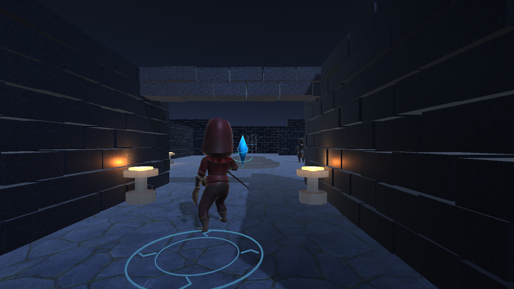

# Echoes of the Ruins

*Echoes of the Ruins* is a third-person, single-player stealth-exploration vertical slice built with Unity 6.3 LTS and URP. The player enters a moonlit citadel, uses shadow and limited echo stones to outsmart three stone guardians, restores three energy cores, and escapes through the rune-sealed north gate.

## Playable coursework build

- Open the repository with Unity `6000.3.20f1`.
- Build order is `MainMenu` then `ProductionRuins`; the prototype scene is not included in the final build.
- Run `Echoes > Build Windows Player`, or open `Builds/EchoesOfTheRuins.exe` after making a local build.
- Windows rendering is locked to Direct3D 11 for stable coursework playback.

Controls: `WASD` move, mouse look, `Space` jump, `Shift` sprint, `C` crouch, `Q` throw an echo stone, hold `E` for 1.5 seconds to attune a core, tap `E` at the unlocked north gate to escape, and `Esc` to pause.

## Implemented systems

- Static modular ruin scene with URP moonlight, post-processing, masonry walls, CC0 architecture, set dressing and baked NavMesh.
- Third-person animated explorer, three animated guardians, camera collision and configurable sensitivity.
- Six-zone route of roughly 129 metres: safe entry, courtyard, shadow gallery, echo passage, altar and north gate.
- Active objective direction and distance, bilingual mission copy, hold progress and interrupted-interaction feedback.
- Patrol, Investigate, Search, Chase and Capture AI with suspicion, sight obstruction, shadow and noise.
- Event-driven objectives, tutorial, compact HUD, menus, pause/caught/victory feedback and score summary.
- Versioned local JSON save data, settings, checkpoint recovery, corrupt-save fallback and recent-run history.
- Procedurally authored local wind and feedback sounds with no external audio dependency.

## Verification

- EditMode: **156 passed, 0 failed**.
- PlayMode: **14 passed, 0 failed**, including menu input, production-scene loading, guardian attacks and the three-core/exit completion flow.
- XML results are stored in `Evidence/TestResults-EditMode.xml` and `Evidence/TestResults-PlayMode.xml`.
- The three final Windows playthroughs are tracked in [PLAYTEST.md](PLAYTEST.md) and must be signed off before submission.

Asset sources and licences are recorded in [Documentation/ASSET_LICENSES.md](Documentation/ASSET_LICENSES.md). GitHub reference projects informed architecture and UX only; no third-party game code or level content was copied.

The coursework narrative is drafted in [Documentation/COURSEWORK_REPORT_DRAFT.md](Documentation/COURSEWORK_REPORT_DRAFT.md), while current verified results and remaining manual acceptance work are summarised in [Evidence/VERIFICATION.md](Evidence/VERIFICATION.md).
